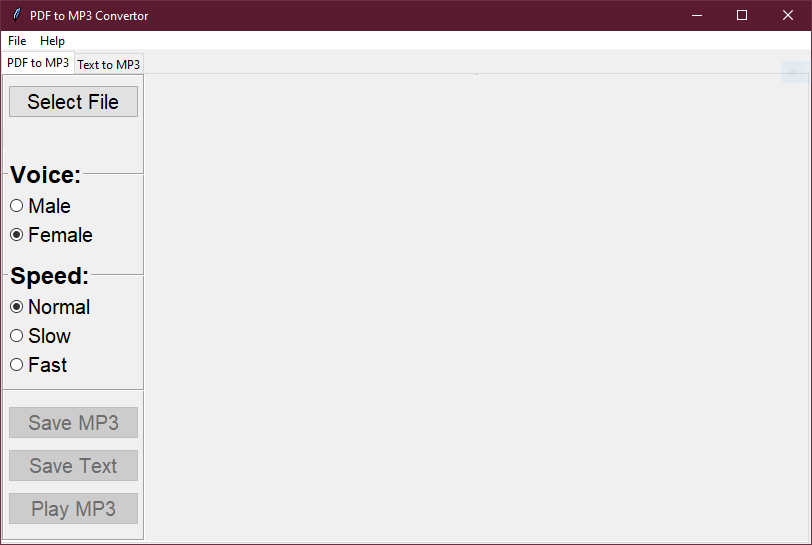
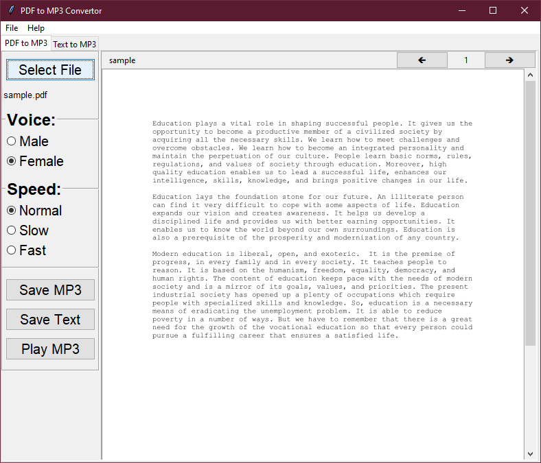
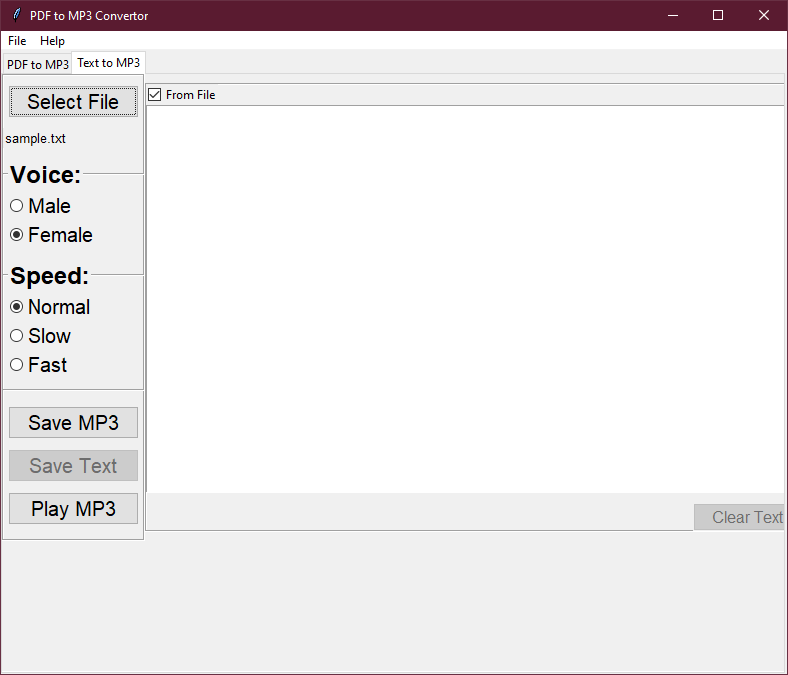
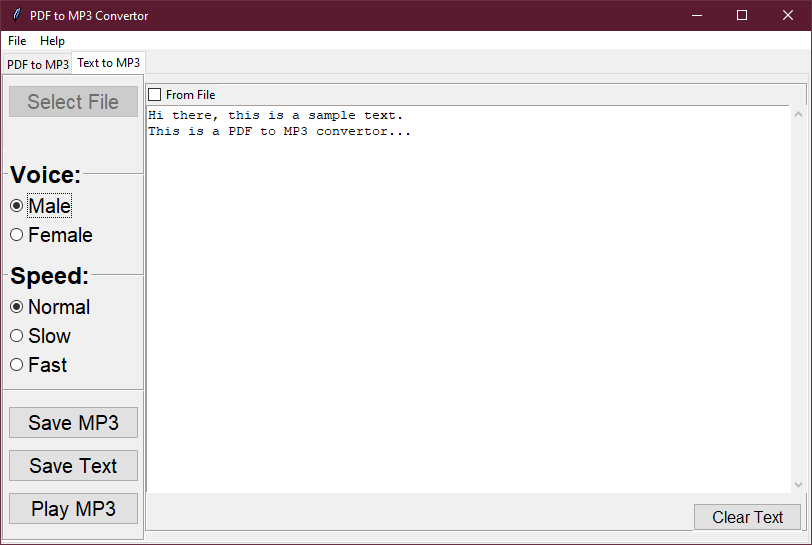

# PDF-to-MP3-GUI

- This is a GUI app that converts a PDF to MP3, made using TKinter.
- It can also convert user inputted text to MP3.
- Various options are included such as
  - saving MP3
  - selection of voice
  - selection of speed.

## Technologies

Made with

- Python 3.8.3

## Screenshots

